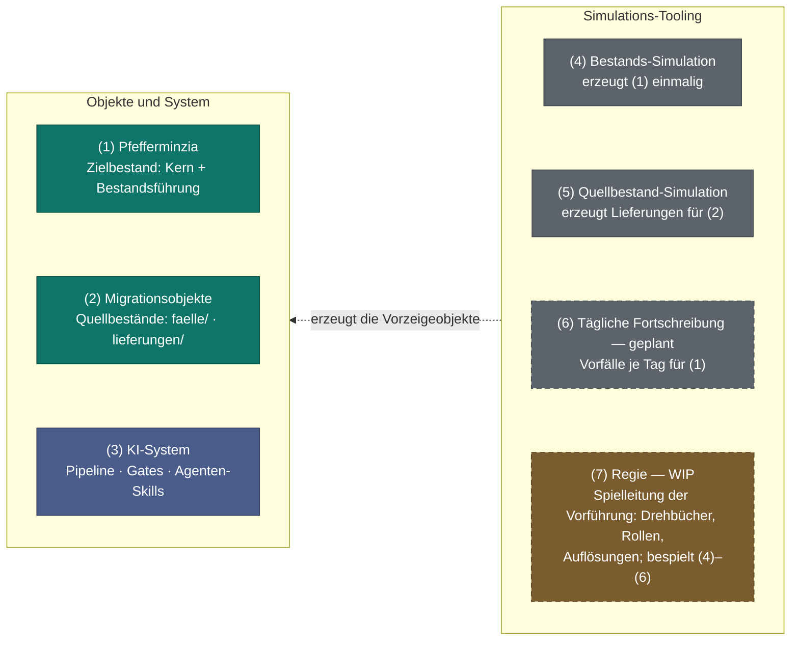
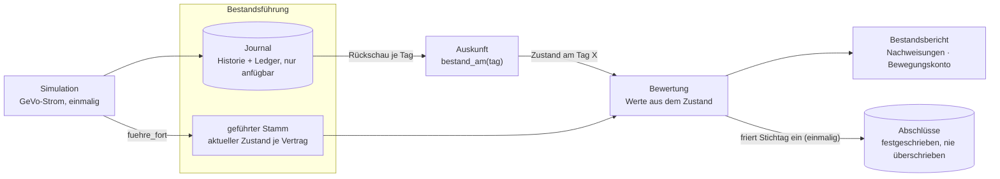

# Rechner-Pipeline — agentische Bestandsmigration Leben

> **Status:** öffentlicher Prototyp, lauffähig Ende-zu-Ende.
> Vorgängerprojekt: [portxlpy](https://github.com/bartlmac/portxlpy).
> Was der aktuelle Stand kann, was er bewusst noch nicht kann und was
> sich zuletzt geändert hat: [`CHANGELOG.md`](CHANGELOG.md).

## Was dieses Repository ist

Ein **agentisches System für die Bestandsmigration Leben und die
Entwicklung des zugehörigen Rechenkerns**. Es löst zwei eng verzahnte
Aufgaben:

1. **Migration:** fremde Tarifgenerationen samt Bestand aus heterogenen
   Lieferungen (Tarifrechner, Tarifmeldung, Bestandsabzüge) in ein
   Zielsystem übernehmen — nachvollziehbar, mit menschlichen
   Entscheidungen an genau den Stellen, an denen Quellen sich
   widersprechen oder das Zielsystem erweitert werden muss.
2. **Rechenkern-Entwicklung:** der Zielkern wird mit KI-Unterstützung
   weiterentwickelt — unter einer Architektur, die Korrektheit erzwingt
   statt erhofft.

Die Arbeitsteilung ist der Kern der Methodik:

- **Agenten schlagen vor** — als versionierte Rollen (Skills): Quellen
  extrahieren, Bestandsdaten-Mappings vorschlagen, Konflikte
  aufbereiten, Code unter den Architekturregeln entwickeln. Ein Agent
  einer späteren Stufe liest nie die Rohquelle einer früheren.
- **Deterministischer Code entscheidet** — Zusammenführung, Vergleich,
  Abdeckung, Transformation, Abnahmerechnung. In `src/` gibt es keine
  Modell-, Provider- oder Token-Fläche und keinen LLM-Pfad in einer
  Prüfung.
- **Menschen entscheiden fachlich** — Widersprüche zwischen Quellen
  werden Objekte mit beiden Lesarten, nie stille Annahmen; jede
  Abnahme ist ein menschliches Gate mit unveränderlichem Snapshot.

Die Komponenten des Repositories, mit ihrem Simulations-Tooling
daneben (die Objekte und das System links sind das Produkt; das
Tooling rechts erzeugt die Vorzeigeobjekte und ist je Objekt
verzichtbar, ohne dass das System etwas verliert):



Die **Regie** (7) ist als Konzept benannt, ihre Dokumentation ist in
Arbeit — Stub: `dev-docs/regie.md`. Sie legt fest, was vorgeführt wird
und unter welchen Bedingungen (Spielleiter-Bereiche, Rollen samt
Zeichnungsordnung, Abbruchkriterien); wie die Simulation gehört sie zum
Gesamtbild, aber nicht zum System.


## Architektur

**Schichten** (Import-Regeln maschinell erzwungen,
`ontologie/code_karte`):

```
quellen  ->  ontologie  ->  spez  ->  kern  ->  bestand  ->  qa  ->  gates
             (T-Box/A-Box)          (Zielkern)  (GeVo-Strom)        (Abnahme)
```

- `quellen/`: deterministische Vorverdichter je Quelltyp (Excel-Mappen,
  DOCX-Meldungen, CSV-Bestandsabzüge) — Agenten lesen nie Rohdateien.
- `ontologie/`: die T-Box (was eine Tarifgeneration ausmacht) und je
  Fall eine A-Box, in der **jede Aussage Provenienz trägt** (Quelle,
  SHA-256, Fundstelle, Akteur). Widersprüche sind Diskrepanz-Objekte.
  Dazu die Datentransformation (Quell-Datenmodell -> Ziel-Ontologie:
  der Agent schlägt das Mapping vor, Code validiert und wendet an,
  Unklarheit blockiert bis zur menschlichen Entscheidung) und der
  **Code-Index**: Module und Tests deklarieren ihren Fachknoten
  (`Knoten: klv/tg2015`), daraus werden Impact, Schichtenprüfung und
  Landkarten-Sichten **berechnet** statt gepflegt — ausgelegt auf ein
  Zielbild von einer Million Codezeilen, in dem es kein Bild "der
  Codebasis" mehr gibt, nur begrenzte Ausschnitte
  (`docs/architektur/landkarte.md`).
- `spez/`: die abgenommene Lesart einer Generation als Parametrierung
  des Kerns — samt maschinell berechnetem Struktur-Urteil
  (Parametrierung vs. neues Produkt).
- `kern/`: der Zielrechenkern (unten).
- `bestand/`: der fortschreibbare Bestand auf dem Kern (unten).
- `qa/` und `gates/`: Abnahmerechnungen und blockierende Prüf-Gates.

**Ablauf eines Migrationsfalls** (Details:
`docs/architektur/migrations-pipeline-v01.md`): Fall-Arbeitsbereich
anlegen und Quellen registrieren (`eingang/` mit SHA-256-Register, nie
still überschrieben — hier beginnt die Provenienzkette) -> je Quelle
Vorverdichtung und Agenten-Extraktion -> deterministischer Merge zur
A-Box -> Diskrepanzen als Entscheidungs-Dossier an den Menschen
(Gate A-Q1) -> Spez -> parametrierter Kern -> Abnahme gegen die
Lieferung (Gate P-K1, Bestandsabzugs-Abgleich) -> Transformation und
Übernahme des Bestands -> **aktuarieller Test je Vertrag an seinen
eigenen Rechenpunkten** auf belegten Stichproben
(`qa/aktuarieller_test`, `qa/testprofil`, `gates/aktuartest`) in drei
einzeln gezeichneten Abnahmen — `A-M1` Stichtagstest, `A-M2`
Verlaufstest, `A-M3` Geschäftsvorfalltest —, die dem Controlling `A-M4`
vorausgehen (ADR-010, ADR-012) ->
**Migrationscontrolling über zwei Stichtage**:
Deckungskapital am Migrations- und am Folgestichtag plus die
Geschäftsvorfälle dazwischen, gegen die gelieferten Erwartungswerte
(`qa/migrationssuite`), zusammengefasst im HTML-Abnahmebericht
(`gates/abnahmebericht`) mit Transformationsspecifikation,
Transformationsergebnis und Bestandsberichten vor/nach als Pflichtartefakte —
als Vorlage für das menschliche Gate A-M4. Prüflücken, Zeilenverlust,
Transformationsbefunde oder nicht entschiedene Konflikte ergeben einen roten
Kopfsatz, ein fehlgeschlagenes Ledger und einen blockierenden Exit-Code. Jede
Eingabe-, Ausgabe- und Ledgerrolle muss dabei eine eigene Datei bezeichnen;
Pfad- oder Hardlink-Aliase blockieren vor dem Rendern. Der in `fall.json`
deklarierte Scope unterscheidet dabei reine Tariffälle von
Bestandsfällen: Nur der Bestands-Scope verlangt und bindet P-B1, eine vollständig
geprüfte Suite und den Abnahmebericht auf denselben Stand.
`gates.transformation_anwenden.wende_an(spec, fall)` löst die Quelle anhand
von `spec.quelle_datei` selbst über das
Fallregister auf, liest die registrierte CSV und führt `validate_spec` gegen
deren physischen Header aus; SHA-256 und Spalten müssen zur Spec passen. Ein
frei übergebbarer Dateipfad ist damit kein Transformations-Eingang mehr.
Berechnungen haben katalogspezifisch exakt einen oder zwei Operanden, und eine
Konfliktentscheidung gilt nur mit nichtleerem Entscheid und Entscheider. Das
persistierte Transformationsergebnis bindet Quell-, Spec- und Ziel-SHA-256,
Quellspalten sowie Quell-/Zielzeilenzahl. Der Abnahmebericht liest die Quelle
über `eingang.json` erneut und rechnet diese Bindungen nach; ohne diese
physische Fallbindung bleibt auch ein ansonsten grüner Renderer-Aufruf
ausdrücklich rot und nichtautoritativ. Im Bestands-Scope verlangt er als Ziel
genau den von Suite und P-B1 geprüften Bestand. A-M4 wiederholt diese Prüfung,
verlangt Spec, Transformationsergebnis sowie Vor-/Nachbericht unter vier festen
Pfad-/SHA-256-Rollen und rendert den Bericht aus den erneut gelesenen Inhalten
zum Bytevergleich neu (ADR-009).

Braucht die Migration eine **Code-Änderung** (Berechnungskatalog,
Bewertung, Produktdefinition), läuft sie als kleines, knotengebundenes
Inkrement auf dem einen Trunk — Landung nur mit grüner Gesamt-Suite
einschließlich der Referenzwerte aller anderen Fälle (ADR-007: parallele
Migrationen in einem Kern).

Die Agenten-Rollen samt Grenzen stehen im Katalog
`docs/architektur/skill-architektur.md`; Architektur-Entscheidungen als
ADRs unter `docs/architektur/`.

## Die Prüf-Gates

Jedes Gate schreibt ein JSON auf stdout und ein Ledger in den
Diagnostics-Ordner; ein Nicht-Null-Exit ist **blockierend** und wird
nie zur Warnung abgeschwächt. Vor der fachlichen Arbeit ersetzt ein roter
Startbeleg einen etwaigen Beleg des vorigen Laufs. Der Abschluss ersetzt
diesen Startbeleg atomar durch das aktuelle Ergebnis. Eine unerwartete
Exception bleibt damit als aktueller fehlgeschlagener Lauf sichtbar; scheitert
das Schreiben des Abschlussbelegs, endet auch eine fachlich gruene Pruefung mit
Exit 50 statt ohne aktuellen Beleg erfolgreich zu erscheinen.
Fehlende Pflichtargumente und ungueltige Optionen liefern ebenfalls genau ein
strukturiertes Fehler-JSON und ersetzen einen alten gruenen Beleg durch den
aktuellen roten Lauf. Syntax- und `argparse`-Choice-Fehler verwenden Exit 2;
fachlich kategorisierte fehlende Eingaben behalten den vom jeweiligen Gate
definierten Fehlercode. `--help` bleibt ein erfolgreicher Aufruf mit Exit 0 und
startet keinen Gate-Lauf.

| Gate | Kommando | Prüft |
|---|---|---|
| P-Q1 | `gates.extract` | deterministische Vorverdichtung einer Quellmappe (Formeln, Werte, Namen, VBA) |
| P-Q2 | `gates.abox_merge` | Zusammenführung der Extraktions-Fragmente zur A-Box |
| P-Q3 | `gates.abox_validate` | A-Box gegen T-Box: Abdeckung, Wertebereiche, Formel-Rück-Check |
| P-K1 | `gates.generation_golden` | der parametrierte Kern gegen die Erwartungswerte der Lieferung; schreibt je Generation einen inhaltsadressierten Beleg des A-Box- und Systemstands |
| P9 | `gates.gate_entscheid` | schema- und kettengültige Snapshots der menschlichen Gates (A-Q1, A-M1, A-M4, A-K1); Annahmen sind mit einem extern verwahrten HMAC-Schlüssel autorisiert, A-M1 und A-M4 verlangen die zum Fall-Scope passenden Pflichtbelege je Gate, und A-M4 verlangt die geltende, signierte A-M1-Annahme auf demselben Stand und pinnt sie als Pflichtrolle `am1_snapshot` (aktuarielle vor finanzieller Abnahme, ADR-010) |
| P-B1 (Version `2.1.0`) | `gates.bestand_validate` | physisches Parquet-Schema mit exakten Arrow-Typen und ohne unbekannte Spalten, nichtleere `tarif_generation`, endliche Beträge in Stamm, Scheiben und Ledger (`NaN` und `inf` sind Datenfehler), Zustandsregeln des geführten Bestands (Ursprungssatz `1`/`POL` am Versicherungsbeginn; Folgezustände nur mit Journal und deckungsgleich zum jüngsten Journalstand), die Tarifwerk-Regel `gamma1 == 0` der Erhöhungsscheiben, die Semantik jeder Ledger-Buchung (GeVo-Vokabular, Betragsart zum GeVo, Generation des Stammsatzes, Vertragsjahr zum Datum, Journalzeile zum Zustandswechsel) mit zeilenweiser Bindung jeder `ERH`-Buchung an genau eine Scheibe, mit `--config` die Betragsidentität jeder STO-/PEX-/TOD-/ABL-/ZUG-Buchung gegen die Kern-Herleitung für genau diese Police (Tarifzellen brauchen `--merkmale`), und Bewegungs-Identitäten je Jahr, Track und Maß; mit `--manifest` zusätzlich den belegten Horizont und die Bytes jeder Tabelle gegen das Laufmanifest. `2.0.0` änderte die normative Akzeptanzmenge (vorher grüne Belege werden rot und umgekehrt), `2.1.0` ergänzt die optionale Manifest-Bindung |
| A-M-Vorlagen | `gates.aktuartest --abnahme A-M1\|A-M2\|A-M3` | rechnet das Ergebnis des aktuariellen Tests (`qa.aktuarieller_test`: je Vertrag am eigenen Verankerungszeitpunkt, am Rechenpunkt ohne Interpolation, ohne Summation — nur Verteilungsgrößen der Residuen je Historientyp) von innen nach außen nach und rendert die Entscheidungsvorlage für das jeweilige Gate A-M1, A-M2 oder A-M3 (im Bestands-Scope alle drei Pflichtvorgänger von A-M4, im Tarif-Scope nur A-M1); Transportsicherung wird getrennt ausgewiesen |
| G2-Vorlage | `gates.abnahmebericht` | berechnet Residuen, Einzel-, Vertrags- und Suiteurteile neu; ein grünes Ledger verlangt vollständige Pflichtartefakte, lückenlose Suite, kongruente Transformationszeilen, keine Transformationsbefunde und keine offenen Konflikte; im Bestands-Scope bindet es P-B1, Suite und Bericht auf denselben Stand sowie die vier Renderer-Eingaben unter festen Pfad-/SHA-256-Rollen |

Dazu prüfen Hypothesis-Tests die aktuariellen Identitäten des Kerns
(`tests/test_kern_algebraisch.py`: qx-Schranken, Barwert-Bilanz
`A + d·ä = 1`, Rekursionen, Äquivalenzprinzip) — unabhängig von jeder
Quell-Lieferung.

## Die Beispielartefakte: die PLV-Fiktion

Vorgeführt wird das System an der fiktiven **Pfefferminzia
Lebensversicherung (PLV)**: der Zielkern ist der PLV-Kern, der Bestand
der PLV-Bestand, und Migrationsfälle übernehmen fremde Bestände in die
PLV. Die Artefakte der Fiktion enthalten keine echten Vertrags-,
Kunden- oder Bestandsdaten; Struktur und Rechnungsgrundlagen sind aus
realen Vorlagen abgeleitet, Unternehmen und Bestände sind frei
erfunden:
`configs/` hält die Bestands-Konfigurationen der PLV
(TOML, von Suite und Berichten geladen), `tests/fixtures/` synthetische
Quellmappen für die Extraktions-Tests, und `lieferungen/` das Frachtgut
der Showcase-Migrationen — die Lieferung eines fiktiven abgebenden
Unternehmens, mit der jeder die Migration selbst durchführen kann
(`ONBOARDING.md`, Abschnitt 3). Einen impliziten Eingangskanal gibt es
nicht: In einen Fall gelangt eine Lieferung nur über die ausdrückliche
Registrierung.

**Der Rechenkern** (`rechner_pipeline.kern`): KLV und
Berufsunfähigkeit auf einem gemeinsamen (Semi-)Markov-Zustandsmodell
mit Thiele-Rückwärtsrekursion; Tafelwerk als reine qx-Vektoren mit
harten Erschöpfungsgrenzen; Monatsreserven für Bilanz-Stichtage
(unterjährige Interpolation) und vertragsweite Bewertung dynamischer
Erhöhungsscheiben. Eine Tarifgeneration, deren Leistungsmerkmale der
Kern bereits kennt, ist eine **Parametrierung** über den Modellpunkt —
kein neuer Kern-Code für die Generation selbst (der Normalfall einer
Migration ist das nicht, siehe oben und ADR-007):

```python
import dataclasses
from rechner_pipeline.kern import KLV_DEFAULT, berechne

ergebnis = berechne(KLV_DEFAULT)
mp = dataclasses.replace(KLV_DEFAULT, x=30, sex="F", zins=0.0225,
                         tafel="DAV2008_T")
ergebnis2 = berechne(mp)
```

Die klassische Kommutationsrechnung lebt als **separater Zweitkern**
(`rechner_pipeline.kommutationskern`) ausschließlich für den
Kreuz-Check (`qa/ueberleitung`) — sie ist kein Bestandteil des
Zielkerns.

**Die Fachdokumentation** ist zweistufig, produktseitig, und jede
Aussage hat genau ein Zuhause (`tests/test_tarifplan_struktur.py` hält
den Schnitt):

1. **Die Grundsatzdokumentation**
   (`docs/mathematik/grundsatzdokumentation.md`): Mathematik und
   Numerik, der die Umsetzung folgt — das allen Produkten gemeinsame
   Rückgrat (Zustandsraum und Semi-Markov-Modell, Thiele-Rekursion,
   Rechnungsgrundlagen-Schicht, Diskretisierung und Rundung,
   Schichtenbild) und in Abschnitt 9 die Methode des Migrationszugangs:
   konstruktive Neuberechnung mit Korrekturschicht, also
   Bestandsmigration ohne Historienmigration. Die Schicht rechnet
   (`kern/korrekturschicht.py`) — sie ist keine zweite Rechenmaschine,
   sondern dieselbe Thiele-Rekursion mit anderen Zahlungen; die
   wertkontinuierlichen Übergänge fallen aus ihrer Dynamik heraus,
   weshalb Stornoannahmen den Kalibrierungsfaktor nicht beeinflussen
   können.
2. **Die Tarifpläne** (`docs/tarifplaene/klv.md`, `bu.md`): die
   Ausgestaltung je Produkt — Zustandsraum des Tarifs, Leistungen,
   Beiträge, Reservebegriffe, GeVo-Katalog mit Betragsformeln,
   Stellschrauben, Gültigkeitsgrenzen. Sie wiederholen das Rückgrat
   nicht, sondern verweisen darauf. Gerendert über eine gepinnte
   Doku-Engine (`docs/engine/`).

Daneben — nicht darunter — steht projektseitig das
**Migrationskonzept** (`docs/migrationskonzept/`): das Verfahren eines
Migrationsfalls (Prüfebenen, Nachweise, Entscheidungen), je Bestand
instanziiert.

**Der Bestand** (`rechner_pipeline.bestand`): synthetische,
deterministisch reproduzierbare Bestände, deren Datenmodell 1:1 auf dem
Kern-Contract liegt. Die Entwicklung über die Zeit ist ein einziger
Strom datierter Geschäftsvorfälle (Neuzugang, Storno, Tod,
Beitragsfreistellung, dynamische Erhöhungen als eigene Scheiben,
Ablauf); jeder Betrag kommt aus dem Kern, die Eintrittsraten aus einer
eigenen Annahmenschicht (3. Ordnung), und das Bewegungskonto führt die
Identität Anfangsbestand + Zugang − Abgang = Endbestand exakt in der
Struktur der BaFin-Nachweisungen. Der Bestand wird **geführt**
(ADR-011): Der Stammsatz trägt je Vertrag den aktuellen Zustand (Status
und seit wann), das Journal die vollständige Aufzeichnung; die Auskunft
rekonstruiert den Bestand zu jedem früheren Tag aus dem Journal, und
die Bewertung liest ausschließlich den Zustand — kein Bewertungspfad
liest das Journal. Gate P-B1 erzwingt die Deckungsgleichheit von
Stammzustand und jüngstem Journalstand. Berichte rechnen jederzeit neu
— **Abschlüsse nicht**: Ein festgeschriebener Stichtagsstand
(`bestand/abschluss.py`, genau einer je Stichtag, mit Kern-Version je
Zeile) wird nie überschrieben; die Kontrolle stellt die Neuberechnung
dagegen und weist Abweichungen aus, statt sie still zu ersetzen.
„Genau einmal" ist dabei nicht nur eine Prüfung vor dem Schreiben,
sondern der Publish selbst: existiert der Zielpfad, scheitert der Aufruf
atomar. Und weil ein festgeschriebener Stand unumkehrbar ist, verlangt er
das **ganze** Lauf-Bundle — Stamm, Historie, Ledger, Scheiben und Config,
geprüft mit derselben Engine wie Gate P-B1, vor dem Schreiben wie vor dem
Prüfen. Eine Teilmenge des Laufs ergäbe sonst einen festgeschriebenen
Falschstand, den die eigene Kontrolle bestätigt:



Der Bestandsbericht rendert das als selbst-enthaltene HTML-Seite:

```bash
python -m rechner_pipeline.bestand.cli_fortschreibung --config configs/bestand_gesamt.toml ...
python -m rechner_pipeline.bestand.cli_report --portfolio <parquet> --out bericht.html ...
python -m rechner_pipeline.bestand.cli_abschluss --config ... --lauf runs/bestand --stichtag 2026-01-01 --bis 2026-01-01
```

**Die Migrationsfälle** (`faelle/`, lokale Arbeitsbereiche, nicht
eingecheckt): je Fall die registrierten Quellen, die A-Box mit
Provenienz, die menschlichen Entscheide (append-only) und alle
abgeleiteten Artefakte bis zum Abnahmebericht. Der erste durchgängige
Fall übernimmt den KLV-Bestand (Tarifgeneration TG2015) der fiktiven
**Baldrian Leben** in die PLV — inklusive der Datentransformation aus
einem fremden Datenmodell und der Zwei-Stichtags-Abnahme; die
Lieferung dazu liegt unter `lieferungen/baldrian/` zum
Selbst-Durchführen.

## Schnellstart

Voraussetzung: **Python 3.11 oder neuer**. Kein LLM-Key nötig — das
Paket ist SDK-frei; Agenten arbeiten über ihre CLIs (unten) auf dem
Repo.

```bash
git clone https://github.com/bartlmac/rechner-pipeline.git
cd rechner-pipeline

python -m venv .venv
. .venv/bin/activate                 # Windows: .venv\Scripts\activate
python -m pip install -r requirements-dev.txt
python -m pip install -e . --no-deps
python -m pytest                     # volle Suite
```

Das ist der eine Installationsweg, derselbe wie in der CI: Die
Pin-Dateien tragen die direkten Abhängigkeiten UND ihre vollständige
transitive Hülle (ein Test hält sie geschlossen). `pip install -e
".[dev]"` allein pinnt nur die direkten Abhängigkeiten und lässt pip
alles Transitive tagesaktuell auflösen — mit `filterwarnings = error`
wurde daraus wiederholt eine rote Suite ohne eigene Änderung; dieser Weg
ist deshalb nicht dokumentiert.

Die Pflicht-E2E-Tests laufen auch im frischen Clone ohne lokalen
Fall-Arbeitsbereich. Das kleine anonymisierte Fixture unter
`tests/fixtures/pk1_am4_minimal/` bindet die synthetische Quell-XLSM mit ihrem
vollen SHA-256. `tests/test_pk1_fixture_e2e.py` materialisiert daraus pro Test
einen temporaeren Fall und prueft echte Vorverdichtung, Formel-Rueckcheck und
P-K1; `tests/test_pk1_am4_beweisvertrag.py` fuehrt denselben Belegpfad bis A-M4.
Fehlt oder driftet das Fixture, wird die Suite rot statt den E2E-Pfad zu
ueberspringen. Details in `ONBOARDING.md`, Abschnitt 5.

Einen Fall anlegen und die Pipeline fahren:

```bash
python -m rechner_pipeline.fall anlegen --fall faelle/mein-fall --scope tarif
# Für eine Bestandsübernahme stattdessen: --scope bestand
python -m rechner_pipeline.fall registrieren --fall faelle/mein-fall --datei <quelle>
python -m rechner_pipeline.fall status --fall faelle/mein-fall

# Dazwischen liegen die Agenten-Stufen (Vorverdichtung, Extraktion je
# Quelle, Merge zur A-Box) — ohne sie enden P-Q3 und P-K1 planmäßig mit
# Exit 2 und nennen die fehlende Datei. Siehe ONBOARDING.md, Abschnitt 3.
python -m rechner_pipeline.gates.abox_validate --fall faelle/mein-fall --repo-root .   # P-Q3
python -m rechner_pipeline.quellen.tafel_import --fall faelle/mein-fall --generation klv/tgX
python -m rechner_pipeline.gates.generation_golden --fall faelle/mein-fall \
    --generation klv/tgX --repo-root .                                                 # P-K1

# menschliche Gates:
python -m rechner_pipeline.ontologie.entscheide --fall ... --diskrepanz ... \
    --wert ... --entscheider ... --begruendung ... --rolle mensch
python -m rechner_pipeline.gates.gate_entscheid --fall ... --gate A-Q1 \
    --entscheid angenommen --entscheider ... --begruendung ... --rolle mensch \
    --freigabe-schluessel /sicher/p9-freigabe.key
```

Parallele `fall registrieren`-Aufrufe desselben Falls werden über eine
fallbezogene Dateisperre serialisiert. `eingang.json` wird erst nach dem
vollständigen Schreiben und Synchronisieren einer temporären Datei atomar
ersetzt; dadurch verlieren konkurrierende Read-Modify-Write-Abläufe keine
Quellen und Leser sehen nie ein teilweise geschriebenes Register.

Der Tafelimport akzeptiert nur eine vollstaendige Exportkette: Das
`export_manifest.json` muss die registrierte XLSM sowie die konkrete
`Tafeln.csv` mit ihren vollstaendigen SHA-256-Werten binden. Fehlende Manifeste,
alte Exporte oder nachtraeglich veraenderte Blatt-CSVs blockieren bereits den
`--dry-run`; in diesem Fall die registrierte XLSM erneut mit P-Q1 extrahieren.
P-Q1 plant die Dateinamen aller Blatt- und Folgeartefakte vor dem ersten
Blattexport kollisionsfrei. Treffen bereinigte Blattnamen oder reservierte
Folgenamen aufeinander, erhaelt der spaetere Kandidat einen deterministischen
`__<n>`-Suffix; `sheet_artifacts` im Exportmanifest bindet jeden
Originalblattnamen an seinen tatsaechlichen Dateinamen. Der Tafelimport loest
das Originalblatt `Tafeln` ueber genau diese Bindung auf.
Zusaetzlich muessen alle Altersvektoren exakt die eindeutigen ganzzahligen Alter
0 bis 123 tragen; jeder qx-Wert muss endlich sein und in `[0,1]` liegen. Diese
Invarianten werden beim Import und erneut beim Laden des Kern-XML erzwungen.

`--rolle` ist bei beiden Kommandos Pflicht (ohne das Flag brechen sie
mit Exit-Code 2 ab) und trägt die Grenze zwischen Mensch und Agent:
`entscheide` nimmt ausschließlich `--rolle mensch` — endgültige
Diskrepanz-Auflösungen sind Menschen vorbehalten. Bei `gate_entscheid`
ist `--rolle agent` zulässig, ein Agent kann ein menschliches Gate damit
aber nur **ablehnen**, nie annehmen.

Eine Annahme braucht zusätzlich `--freigabe-schluessel`. Die Datei wird vom
Menschen ausserhalb des Falls und ausserhalb des Agentenzugriffs verwahrt,
muss mindestens 32 kryptografisch zufällige Byte lang sein und unter POSIX
Rechte 0600 sowie genau einen Hardlink besitzen. Das
Flag kann bei einer Schluesselrotation wiederholt werden: alte Schluessel
zuerst zum Pruefen der Historie, der letzte Schluessel signiert den neuen
Snapshot. Weder Schluesselbytes noch Pfad werden in Snapshot oder Ledger
gespeichert. P9 rechnet beim Lesen Schema, vollständigen Inhalts-Hash,
Dateinamen, Freigabesignatur sowie Existenz, Zyklen und eindeutige Spitze der
Vorgängerkette nach (ADR-008).

Die Code-Ontologie navigiert und begrenzt Änderungen:

```bash
python -m rechner_pipeline.ontologie.code_index --tests tests    # Knoten <-> Modul/Test, Drift
python -m rechner_pipeline.ontologie.code_karte                  # Import-Graph vs. Schichtenkarte
git diff --name-only | python -m rechner_pipeline.ontologie.impact
python -m rechner_pipeline.ontologie.landkarte --format mermaid --umfang knoten --out k.mmd
```

## Reproduzierbarkeit und Verlässlichkeit

- **Deterministisch:** gleiche Eingaben ergeben byte-identische
  Artefakte (Extrakte, Berichte, Parquet-Bestände, Landkarten); Seeds
  stehen in Configs, nie im Code.
- **SDK-frei:** keine Modell-Abhängigkeit im Paket; die Erwartungswerte
  jeder Abnahme stammen aus der Lieferung, nie vom Modell.
- **Fail fast:** fehlende Tafeln, verletzte Schichtregeln, Bausteine
  ohne Ontologie-Knoten und Register-Abweichungen im Fall-Eingang sind
  harte Fehler, keine Warnungen.
- **Gepinnte Abhängigkeiten:** die direkten exakt in `pyproject.toml`,
  ihre vollständige transitive Hülle in `requirements.txt` /
  `requirements-dev.txt` — der eine Installationsweg (Schnellstart
  oben), derselbe, den die CI fährt. `tests/test_abhaengigkeiten.py`
  prüft, dass jede direkte Abhängigkeit mit ihrer Version in den
  Pin-Dateien steht und die installierte transitive Hülle darin
  geschlossen ist.

## Agenten-Anbindung

Claude-CLI wird über `.claude/skills/` unterstützt, Codex-CLI über
`AGENTS.md` plus gespiegelte Skills unter `.agents/skills/`; die
Spiegel-Parität ist test-erzwungen. Die portable Basis ist: lokale
Dateien plus einfache Python-Kommandos — kein MCP/RPC-Pfad.

## Mitwirken

Beiträge laufen über GitHub-Collaborators auf Vertrauensbasis; siehe
`CONTRIBUTING.md` und `AGENTS.md`. **Arbeitsweise am gemeinsamen
Branch:** klonen und lokal arbeiten, kein direkter Push in den
gemeinsamen Branch — Änderungen werden nach Absprache übernommen.

## Lizenz

MIT — siehe `LICENSE`.

Die Rechnungsgrundlagen (`src/rechner_pipeline/kern/tafeln.xml`) sind
veröffentlichte DAV-Tafeln bzw. synthetische Vektoren; die Herkunft
steht bei den meisten Vektoren in der Datei selbst (siehe
`CONTRIBUTING.md`).
