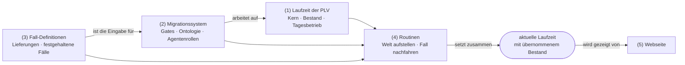
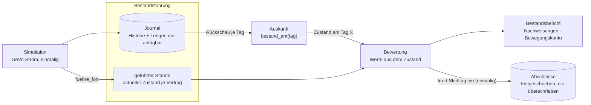

# Rechner-Pipeline — agentische Bestandsmigration Leben

> **Status:** öffentlicher Prototyp und Arbeitsstand, lauffähig Ende-zu-Ende,
> aber noch nicht produktiv einsetzbar.
> Vorgängerprojekt: [portxlpy](https://github.com/bartlmac/portxlpy).
> Was der aktuelle Stand kann und was er bewusst noch nicht kann:
> [`CHANGELOG.md`](CHANGELOG.md).

Ein **agentisches System für die Bestandsmigration Leben**. Es übernimmt
fremde Tarifgenerationen samt Bestand aus heterogenen Lieferungen
(Tarifrechner, Tarifmeldung, Bedingungen, Bestandsabzüge) in ein Zielsystem
— nachvollziehbar, mit menschlichen Entscheidungen an genau den Stellen, an
denen Quellen sich widersprechen oder das Zielsystem erweitert werden muss.

Vorgeführt wird es an einem erfundenen Versicherer: Die **Pfefferminzia
Lebensversicherung (PLV)** übernimmt den Bestand der ebenso erfundenen
**Baldrian Leben**. Das Repository enthält keine echten Vertrags-, Kunden-
oder Bestandsdaten; Struktur und Rechnungsgrundlagen sind aus realen
Vorlagen abgeleitet, Unternehmen und Bestände sind frei erfunden.

## Was dieses Repository ist

Fünf Gegenstände, keine Infrastruktur
([ADR-027](docs/architektur/adr-027-fuenf-gegenstaende-keine-infrastruktur.md)):

| | Gegenstand | Wozu | Wo |
|---|---|---|---|
| 1 | **Laufzeit der PLV** | die Pfefferminzia mit ihrem eigenen Geschäft: Rechenkern, geführter Bestand, Tagesbetrieb. Sie läuft ohne jede Migration. | `src/rechner_pipeline/kern`, `src/rechner_pipeline/bestand`, `src/rechner_pipeline/betrieb`, `configs/` |
| 2 | **Migrationssystem** | das KI-System mit seinen jeweiligen Fähigkeiten: Quellen vorverdichten, Aussagen mit Herkunft führen, den Tarif parametrieren, prüfen und abnehmen; dazu die Agentenrollen | `src/rechner_pipeline/quellen`, `src/rechner_pipeline/ontologie`, `src/rechner_pipeline/spez`, `src/rechner_pipeline/qa`, `src/rechner_pipeline/gates`, `src/rechner_pipeline/fall.py`, `.claude/`, `.agents/` |
| 3 | **Fall-Definitionen** | was man braucht, um eine Migration durchzuspielen: die Lieferungen der abgebenden Gesellschaft, das Werkzeug, das sie erzeugt, und die festgehaltenen Fälle zum Nachfahren | `lieferungen/`, `quellsystem/`, `pakete/` |
| 4 | **Routinen** | deterministisch eine Welt aufstellen, einen Fall darin führen oder nachfahren — und so die aktuelle Laufzeit erzeugen | `deploy/welt/`, `deploy/plv/` |
| 5 | **Webseite** | der Auftritt der PLV und die Werkzeuge, die ihn rendern und verknüpfen | `vorzeige-seite/`, `werkzeuge/` |


```mermaid
flowchart LR
    G3["(3) Fall-Definitionen
Lieferungen · festgehaltene Fälle"]
    G2["(2) Migrationssystem
Gates · Ontologie · Agentenrollen"]
    G1["(1) Laufzeit der PLV
Kern · Bestand · Tagesbetrieb"]
    G4["(4) Routinen
Welt aufstellen · Fall nachfahren"]
    LZ(["aktuelle Laufzeit
mit übernommenem Bestand"])
    G5["(5) Webseite"]

    G3 -- "ist die Eingabe für" --> G2
    G2 -- "arbeitet auf" --> G1
    G1 & G2 & G3 --> G4
    G4 -- "setzt zusammen" --> LZ
    LZ -- "wird gezeigt von" --> G5
```

**Quer zu allen fünf** liegen `tests/`, `docs/` (Fachdokumentation und
Architektur-Entscheidungen), `dev-docs/` (geplante Vorhaben),
`src/rechner_pipeline/models` (Datenverträge), `deploy/dev` und
`.devcontainer/` (Entwicklungsumgebung) und `.github/` (Prüfläufe und
Image-Bau).

**Zwei Verzeichnisse tragen zwei Gegenstände.** `werkzeuge/` enthält neben
den Werkzeugen der Webseite vier für den Live-Lauf eines Falls
(`werkzeuge/vorfuehrung.py`, `werkzeuge/lagebild.py`,
`werkzeuge/aufzeichnung.py`, `werkzeuge/sitzungsprobe.py`); sie gehören zum
Migrationssystem. `deploy/welt/` enthält neben den Routinen die Definition
des Falls der Vorführung (`deploy/welt/fall-baldrian-klv-tg2015.conf`).

**Bewusst nicht hier:** die laufende Instanz (Rechner, Schlüssel, Ablage),
das Hosting der Seite, die Einrichtung einzelner Rechner und die Regie mit
Drehbüchern und Auflösungen noch nicht gefahrener Fälle. Eine Laufzeit ist
kein Bestandteil des Systems, sondern eine seiner Instanzen — aus dem Stand
dieses Repositorys neu aufstellbar und mit jeder anderen Instanz
vergleichbar: Dieselbe Welt, zweimal aufgestellt, trägt in ihrer Ablage
dieselben Bytes, gleich mit welchen Schlüsseln gezeichnet wird.

**Der Stand von `main`** ist der Stand nach dem jüngsten festgehaltenen
Fall: Was der Fall am Zielsystem gebaut hat, liegt im Code. Der Stand davor
ist ein Commit der Geschichte, den das Paket des Falls nennt. Die Routine
stellt die Welt auf jenem Stand auf und fährt den Fall auf diesem nach.

Innerhalb des Pakets regelt ADR-017, wer wen importieren darf: Das
Migrationssystem ist das KI-Tool, das bei jedem Versicherer unverändert
einsetzbar wäre; die PLV ist die Vorzeige, an der es sich zeigt; und was
ihre Bestände erzeugt, sind Vorzeige-Werkzeuge. Die Schichtenkarte misst
das je Modul (`python -m rechner_pipeline.ontologie.code_karte`).

## Wie das System arbeitet

Die Arbeitsteilung ist der Kern der Methodik:

- **Agenten schlagen vor** — als versionierte Rollen (Skills): Quellen
  extrahieren, Bestandsdaten-Mappings vorschlagen, Konflikte aufbereiten,
  Code unter den Architekturregeln entwickeln. Ein Agent einer späteren
  Stufe liest nie die Rohquelle einer früheren.
- **Deterministischer Code entscheidet** — Zusammenführung, Vergleich,
  Abdeckung, Transformation, Abnahmerechnung. In `src/` gibt es keine
  Modell-, Provider- oder Token-Fläche und keinen LLM-Pfad in einer Prüfung.
- **Menschen entscheiden fachlich** — Widersprüche zwischen Quellen werden
  Objekte mit beiden Lesarten, nie stille Annahmen; jede Abnahme ist ein
  menschliches Gate mit unveränderlichem, gezeichnetem Snapshot.

Ein Fall läuft so: Der Vorstand beauftragt ihn (`A-M6`). Jede Quelle wird
vorverdichtet und extrahiert, die Aussagen werden zur A-Box zusammengeführt,
und Widersprüche gehen als Dossier an den Menschen (`A-Q1`). Aus der
abgenommenen Lesart entsteht die Parametrierung des Kerns; was der Fall am
Zielsystem ändert, wird als Kernstand (`A-K2`), T-Box-Stand (`A-O1`) und
Tarifwerk (`A-T1`) abgenommen. Der Bestand wird transformiert und
übernommen. Drei aktuarielle Tests je Vertrag (`A-M1`, `A-M2`, `A-M3`) gehen
der Migrationsabnahme (`A-M4`) voraus. Danach nimmt der Betrieb den Zugang
mit einer Probe auf einer Kopie der Ablage ab (`A-B2`), die Ablage wird mit
dem übernommenen Bestand neu aufgesetzt und ihr Anfangsbestand gebunden
(`A-B3`). Geht ein Stand nach außen, zeichnet der Betrieb die Auslieferung
(`A-B1`). Ein scheiternder Fall endet mit dem gezeichneten Abbruch (`A-M5`).
Der ganze Ablauf mit seinen Belegen steht in
[docs/architektur/ablauf-eines-falls.md](docs/architektur/ablauf-eines-falls.md).

Braucht die Migration eine **Code-Änderung** am Zielsystem
(Berechnungskatalog, Bewertung, Produktdefinition), läuft sie als kleines,
knotengebundenes Inkrement auf dem einen Trunk — Landung nur mit grüner
Gesamt-Suite einschließlich der Referenzwerte aller anderen Fälle (ADR-007).
Das ist der Normalfall einer Migration, nicht die Ausnahme.

## Die Laufzeit der PLV

**Der Rechenkern** (`rechner_pipeline.kern`): KLV und Berufsunfähigkeit auf
einem gemeinsamen (Semi-)Markov-Zustandsmodell mit
Thiele-Rückwärtsrekursion; Tafelwerk als reine qx-Vektoren mit harten
Erschöpfungsgrenzen; Monatsreserven für Bilanz-Stichtage und vertragsweite
Bewertung dynamischer Erhöhungsscheiben. Eine Tarifgeneration, deren
Leistungsmerkmale der Kern bereits kennt, ist eine **Parametrierung** über
den Modellpunkt:

```python
import dataclasses
from rechner_pipeline.kern import KLV_DEFAULT, berechne

ergebnis = berechne(KLV_DEFAULT)
mp = dataclasses.replace(KLV_DEFAULT, x=30, sex="F", zins=0.0225,
                         tafel="DAV2008_T")
ergebnis2 = berechne(mp)
```

Die Mathematik dahinter steht in der
[Grundsatzdokumentation](docs/mathematik/grundsatzdokumentation.md), die
Ausgestaltung je Produkt in den [Tarifplänen](docs/tarifplaene/). Abschnitt
9 der Grundsatzdokumentation beschreibt die Methode des Migrationszugangs:
konstruktive Neuberechnung mit Korrekturschicht, also Bestandsmigration
ohne Historienmigration.

**Der Bestand** (`rechner_pipeline.bestand`): synthetisch und
deterministisch reproduzierbar; sein Datenmodell liegt 1:1 auf dem Vertrag
des Kerns. Die Entwicklung über die Zeit ist ein einziger Strom datierter
Geschäftsvorfälle (Neuzugang, Storno, Tod, Beitragsfreistellung, dynamische
Erhöhungen als eigene Scheiben, Ablauf). Jeder Betrag kommt aus dem Kern,
und das Bewegungskonto führt die Identität Anfangsbestand + Zugang − Abgang
= Endbestand exakt. Der Bestand wird **geführt** (ADR-011): Der Stammsatz
trägt je Vertrag den aktuellen Zustand, das Journal die vollständige
Aufzeichnung. Berichte rechnen jederzeit neu — **Abschlüsse nicht**: Ein
festgeschriebener Stichtagsstand wird nie überschrieben; die Kontrolle
stellt die Neuberechnung dagegen und weist Abweichungen aus.


```mermaid
flowchart LR
    SIM["Simulation
GeVo-Strom, einmalig"]
    subgraph BF["Bestandsführung"]
        STAMM["geführter Stamm
aktueller Zustand je Vertrag"]
        JOURNAL[("Journal
Historie + Ledger, nur anfügbar")]
    end
    AUSKUNFT["Auskunft
bestand_am(tag)"]
    BEW["Bewertung
Werte aus dem Zustand"]
    BERICHT["Bestandsbericht
Nachweisungen · Bewegungskonto"]

    SIM -- "fuehre_fort" --> STAMM
    SIM --> JOURNAL
    JOURNAL -- "Rückschau je Tag" --> AUSKUNFT
    AUSKUNFT -- "Zustand am Tag X" --> BEW
    STAMM --> BEW
    BEW --> BERICHT
    BEW -- "friert Stichtag ein (einmalig)" --> ABSCHLUSS[("Abschlüsse
festgeschrieben, nie überschrieben")]
```

**Der Tagesbetrieb** (`rechner_pipeline.betrieb`): Die PLV läuft Tag für
Tag — Neugeschäft je Werktag, nächtliche Fortschreibung, Tagesjournal,
Monatsabschluss. Wie Bestand und Tagesbetrieb entstehen, steht in
[docs/simulation/](docs/simulation/README.md).

## Schnellstart

Voraussetzung: **Python 3.11 oder neuer**. Kein LLM-Key nötig — das Paket
ist SDK-frei; Agenten arbeiten über ihre CLIs auf dem Repository.

**1. Installieren und die Suite fahren**

```bash
git clone https://github.com/bartlmac/rechner-pipeline.git
cd rechner-pipeline

python -m venv .venv
. .venv/bin/activate
python -m pip install -r requirements-dev.txt
python -m pip install -e . --no-deps
python -m pytest -n auto --dist loadfile     # volle Suite, parallel (ADR-019)
```

Das ist der eine Installationsweg, derselbe wie in der CI: Die Pin-Dateien
tragen die direkten Abhängigkeiten und ihre vollständige transitive Hülle.
Referenzumgebung ist Linux mit Python 3.11. Wer nicht auf Linux arbeitet,
fährt die Suite im Container, der genau diese Umgebung ist
(`deploy/dev/Dockerfile`; Anleitung in `ONBOARDING.md`, Abschnitt 2).

**2. Die Laufzeit aufstellen**

```bash
deploy/welt/laufzeit_aufstellen.sh ~/plv-welt pakete/baldrian-klv-tg2015-fall3
```

Ein Aufruf, ohne Agenten: Er stellt eine Welt auf dem Stand vor dem Fall
auf (Ablage der PLV, Linie, Erstabnahmen, eigene Schlüssel), fährt den
festgehaltenen dritten Fall der Baldrian nach und bringt den übernommenen
Bestand in die Ablage. Das rechnet rund 45 Minuten. Mit `--bis <haltepunkt>`
endet der Lauf an einer Stelle des Falls, an der man selbst liest und
zeichnet; derselbe Aufruf fährt danach weiter. Einzelheiten:
[deploy/welt/README.md](deploy/welt/README.md).

**3. Einen Fall selbst führen**

```bash
python -m rechner_pipeline.fall anlegen --fall faelle/mein-fall --scope bestand
python -m rechner_pipeline.fall registrieren --fall faelle/mein-fall --datei <quelle>
python -m rechner_pipeline.fall status --fall faelle/mein-fall
```

In einen Fall gelangt eine Lieferung nur über die ausdrückliche
Registrierung — dort beginnt die Kette der Herkunft. Danach folgen die
Stufen der Agenten und die Gates. Den Weg beschreibt `ONBOARDING.md`,
Abschnitt 3; die Rollen der Agenten stehen in
[docs/architektur/skill-architektur.md](docs/architektur/skill-architektur.md).

## Wo was steht

| Frage | Dokument |
|---|---|
| Wie läuft ein Migrationsfall ab, vom Auftrag bis zur Auslieferung? | [docs/architektur/ablauf-eines-falls.md](docs/architektur/ablauf-eines-falls.md) |
| Welche Architektur-Entscheidungen gelten? | [docs/architektur/](docs/architektur/README.md), dazu die erzeugte [Landkarte](docs/architektur/landkarte.md) |
| Wer zeichnet welches Gate, und worüber? | [ADR-012](docs/architektur/adr-012-gate-namensordnung.md), [ADR-018](docs/architektur/adr-018-rollenmodell-und-schluesselklassen.md) |
| Was hält ein Prüf-Gate ein, und warum trägt es seine Version? | [docs/architektur/gate-vertrag-und-versionen.md](docs/architektur/gate-vertrag-und-versionen.md) |
| Welche Mathematik rechnet der Kern? | [docs/mathematik/](docs/mathematik/README.md) |
| Was verspricht die PLV in ihren Tarifen? | [docs/tarifplaene/](docs/tarifplaene/README.md) |
| Wie führt ein Unternehmen einen Migrationsfall durch? | [docs/migrationskonzept/](docs/migrationskonzept/README.md) |
| Wie entstehen Bestand und Tagesbetrieb der PLV? | [docs/simulation/](docs/simulation/README.md) |
| Welche Fälle gibt es, und was ist nachfahrbar? | [docs/faelle/](docs/faelle/README.md), [pakete/](pakete/README.md), [lieferungen/](lieferungen/README.md) |
| Wie stelle ich eine Welt auf und führe einen Fall darin? | [deploy/welt/](deploy/welt/README.md) |
| Wie läuft das Image der Laufzeit im Tagesbetrieb? | [deploy/plv/](deploy/plv/README.md) |
| Wie entsteht die Webseite, wie führe ich einen Lauf vor? | [werkzeuge/](werkzeuge/README.md) |
| Wie arbeite ich mit — als Mensch oder als Agent? | [ONBOARDING.md](ONBOARDING.md), [AGENTS.md](AGENTS.md), [CONTRIBUTING.md](CONTRIBUTING.md) |
| Was ist erkannt, aber noch nicht gebaut? | [dev-docs/](dev-docs/README.md) |

## Reproduzierbarkeit und Verlässlichkeit

- **Deterministisch:** gleiche Eingaben ergeben byte-identische Artefakte
  (Extrakte, Berichte, Parquet-Bestände, Landkarten); Seeds stehen in
  Configs, nie im Code.
- **SDK-frei:** keine Modell-Abhängigkeit im Paket; die Erwartungswerte
  jeder Abnahme stammen aus der Lieferung, nie vom Modell.
- **Fail fast:** fehlende Tafeln, verletzte Schichtregeln, Bausteine ohne
  Ontologie-Knoten und Register-Abweichungen im Fall-Eingang sind harte
  Fehler, keine Warnungen.
- **Abgenommene Gegenstände ändern sich nicht still:** Kern und Tarifwerk
  sind gezeichnet. Ein Test hält am Baum fest, dass er sie so trägt wie der
  festgehaltene Fall (`tests/test_pakete.py`) — sonst wäre die Laufzeit aus
  `main` nicht mehr nachfahrbar.
- **Gepinnte Abhängigkeiten:** die direkten exakt in `pyproject.toml`, ihre
  vollständige transitive Hülle in `requirements.txt` und
  `requirements-dev.txt`; `tests/test_abhaengigkeiten.py` hält die Hülle
  geschlossen.

## Agenten-Anbindung

Claude-CLI wird über `.claude/skills/` unterstützt, Codex-CLI über
`AGENTS.md` plus gespiegelte Skills unter `.agents/skills/`; die
Spiegel-Parität ist test-erzwungen. Die portable Basis ist: lokale Dateien
plus einfache Python-Kommandos — kein MCP/RPC-Pfad.

## Mitwirken

Beiträge laufen über GitHub-Collaborators auf Vertrauensbasis; siehe
`CONTRIBUTING.md` und `AGENTS.md`. **Arbeitsweise am gemeinsamen Branch:**
klonen und lokal arbeiten, kein direkter Push in den gemeinsamen Branch —
Änderungen werden nach Absprache übernommen. Wie Pull Requests geschnitten
werden, regelt ADR-027.

## Lizenz

MIT — siehe `LICENSE`.

Die Rechnungsgrundlagen (`src/rechner_pipeline/kern/tafeln.xml`) sind
veröffentlichte DAV-Tafeln bzw. synthetische Vektoren; die Herkunft steht
bei den meisten Vektoren in der Datei selbst (siehe `CONTRIBUTING.md`).
