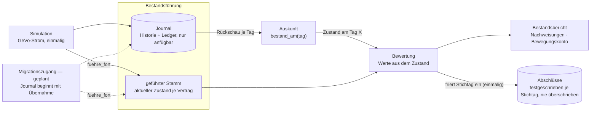

# ADR-011: Bestandsfuehrung mit gefuehrtem Zustand und Journal

Status: akzeptiert (Auftraggeber, 2026-08-26); Umsetzung in diesem Branch.

## Kontext

Das Repo enthaelt fuenf Komponenten, die bisher nicht sauber benannt
waren: (1) das KI-System fuer Rechenkern-Entwicklung und Migration
(Architektur, Pipeline, Agenten, Ontologie), (2) den Vorzeige-Zielbestand
der fiktiven Pfefferminzia samt Kern, (3) die Migrationsfaelle, (4) die
Simulation, die den Vorzeigebestand EINMALIG erzeugt, und (5) die
Simulation von Quellbestaenden fuer Migrationsfaelle (Regie, ausserhalb
des Pakets).

Die Komponenten (2) und (4) sind im Code vermischt, und zwar an der
tragenden Stelle: **Es gibt keine Bestandsfuehrung, sondern nur eine
Simulation mit nachgelagerter Ableitung.** Der Stammsatz eines Vertrags
traegt seinen URSPRUNGSzustand (status_id 1, POL, Statusdatum =
Versicherungsbeginn — von validate_portfolio erzwungen); alles Spaetere
liegt als Zeilen der Statushistorie daneben. Jede Bewertung baut daraus
zuerst eine Mehrzeilen-Sicht (`bestand_mit_historie`) und waehlt dann
rueckwirkend die juengste Statuszeile zum Stichtag aus (`zeitscheibe`) —
an sechs Stellen in Auswertung, Kennzahlen und Bericht. Die Verweildauer
im Zustand wird bei jeder Bewertung aus der Historie zurueckgerechnet
(`_bu_phasenbeginne`, `_pex_jahre`).

Kein Bestandsfuehrungssystem arbeitet so. Es fuehrt den Zustand als
DATUM im Vertragssatz ("Status BU seit 01.04.2023"), gesetzt in dem
Moment, in dem der Geschaeftsvorfall gebucht wird; die Historie ist ein
Journal fuer Nachweis und Auskunft, nicht die Eingabe der Bewertung.

Die Vermischung war fuer den selbst erzeugten Schaubestand konsistent
(der Ereignisstrom IST dort die Wahrheit) und bricht genau am
eigentlichen Zweck des Systems: Ein migrierter Vertrag kommt als
Zustandsschnappschuss ohne Historie (Grundsatzdokumentation 9.12 und 9.14). Im heutigen
Modell muesste man ihm eine Historie ERFINDEN, damit die Ableitung
funktioniert — das Replay-Surrogat, das die Methode ausdruecklich
ausschliesst. Drei
zuvor getrennt gemeldete Befunde haben diese eine Ursache: die
fehlenden Verankerungsattribute (s_0, d_0, t_a), der gamma1-Defekt der
Erhoehungsscheiben (Rekonstruktion zur Bewertungszeit statt Persistenz
der Schicht-Rechnungsgrundlagen; gemessen +2,0 % Jahresbeitrag der
Scheibe) und die Ableitung des Zustands zur Bewertungszeit selbst.

## Entscheidung

### 1. Drei Komponenten, drei Rollen

* **Bestandsfuehrung** (`bestand/fuehrung.py`, neu): fuehrt je Vertrag
  den AKTUELLEN Zustand — Status, seit wann (`status_date` = Beginn des
  aktuellen Status), Summen, Beitrag, Schichten mit ihren eigenen
  Rechnungsgrundlagen — und das **Journal** als vollstaendige, nur-anfuegbare Aufzeichnung —
  das Statusjournal (Historie) fuehrt die Zustandswechsel, das
  Betragsjournal (Ledger) die Geschaeftsvorfaelle mit ihren
  Kern-Betraegen; die Fuehrung setzt den Stammzustand aus dem
  Statusjournal. Der gefuehrte Stamm und das Journal sind per Invariante
  deckungsgleich: Der Stammzustand IST der juengste Journalstand.
* **Bewertung** (`bestand/auswertung.py`, umgebaut): rechnet
  ausschliesslich aus dem gefuehrten Zustand. Verweildauer =
  f(status_date, Stichtag); PEX-Jahr = f(insurance_start, status_date).
  **Kein Bewertungspfad liest das Journal.** Das ist dieselbe
  Historienfreiheit, die die Grundsatzdokumentation (9.14) vom Rechenkern verlangt —
  eine Ebene hoeher angewendet.
* **Simulation** (`bestand/ereignisse.py`, Rolle geschaerft): erzeugt
  den Vorzeigebestand einmalig, als Strom von Buchungen. Ihr Ergebnis
  ist ein GEFUEHRTER Bestand (aktueller Stamm + Journal), kein
  Rohmaterial, aus dem sich jeder Leser den Zustand selbst ableitet.

Die zwei Invarianten stehen bewusst als Text statt als Kanten im Bild
(ein Verbot als gemalte Kante laese sich wie ein Datenfluss): Kein
Bewertungspfad liest das Journal, und der Stammzustand ist der
juengste Journalstand — Gate P-B1 erzwingt die Deckung.

### 2. Ein Buchungsweg

Zustandsaenderungen laufen ueber genau eine Stelle
(`fuehrung.fuehre_fort`): Sie nimmt das Journal entgegen und setzt daraus
den neuen Stammzustand — der gemeinsame Trichter fuer die Simulation
heute und fuer den Migrationszugang morgen. Die Journalzeilen selbst
entstehen davor, bei der Simulation in `ereignisse.fortschreiben`. Zwei Schreibwege auf denselben Bestand sind der
Mechanismus, aus dem Drift entsteht; der gamma1-Defekt war genau das im
Kleinen.

### 3. Auskunft statt Zeitscheibe

Die Rueckschau "Bestand am Tag X" ist eine **Auskunftsfunktion aus dem
Journal** (`fuehrung.bestand_am`): Sie rekonstruiert den gefuehrten
Zustand zu jedem frueheren Datum — moeglich, weil das Journal
vollstaendig gespeichert bleibt. Berichte (Verlaufe, Bewegungskonto,
Nachweisungen) komponieren Auskunft + Bewertung: Zustand am Tag aus dem
Journal, Werte aus dem Zustand. Auskunft DARF das Journal lesen — das
ist ihr Zweck; nur die Bewertung darf es nicht.

Das Modul `bestand/zeitscheibe.py` — die rueckwirkende
Simulations-Sicht — wird pensioniert. Die reinen Kalenderhelfer
(`months_between`, `derived_age`) ziehen in die Fuehrung um.

### 4. Schichten sind Vertragsbestandteil

Erhoehungsscheiben tragen ihre Rechnungsgrundlagen selbst (zunaechst:
`gamma1`, per Tarifwerk-Regel 0 — Bezugsgroesse bleibt die GrundVS).
Die Bewertung liest die Schicht, statt sie aus der Tarifgeneration zu
rekonstruieren. Das behebt den gemessenen Defekt und ist zugleich die
Richtung der Grundsatzdokumentation (9.11: Parameter persistieren, Werte
reproduzierbar).

### 5. Der Stammsatz traegt den aktuellen Zustand

`bestand.parquet`/`bestand_gesamt.parquet` wechseln die Semantik: Die
Statusspalten (`status_id`, `status_code`, `status_date`) beschreiben
den aktuellen Zustand am Fuehrungsstand, nicht mehr den Ursprung. Die
Spaltenmenge bleibt unveraendert. `validate_portfolio` prueft kuenftig:
gueltiger Status (auch terminal), `status_date` zwischen
Versicherungsbeginn und Fuehrungsstand, `status_id` = Nummer des
juengsten Statuswechsels; Gate P-B1 prueft zusaetzlich die
Deckungsgleichheit von Stamm und Journal. Die bisherige
Ursprungszustands-Invariante gilt weiterhin — aber als Aussage ueber den
JOURNALANFANG (erste Zeile je Vertrag), nicht ueber den Stammsatz.

Damit hat auch der Migrationszugang seinen Platz, ohne dass hier gebaut
wird: Ein uebernommener Vertrag ist ein Stammsatz mit geliefertem
Zustand (s_0, d_0 via status_code/status_date, t_a), dessen Journal mit
dem Uebernahme-Ereignis BEGINNT statt mit dem Vertragsbeginn.

### 6. Abschluesse sind festgeschrieben

Berichte werden jederzeit neu gerechnet — ein ABGESCHLOSSENER Stand
nicht: Der Bilanzwert eines Stichtags darf sich nachtraeglich nicht
bewegen, auch wenn der Kern sich weiterentwickelt (Leitlinie des
Auftraggebers: Logik eines funktionierenden Unternehmens). Deshalb
gehoeren Abschluesse zum Datenhaushalt der Fuehrung
(`bestand/abschluss.py`, Tabellenfamilie `ABSCHLUSS_SPALTEN`):

* Ein Abschluss friert die einzelvertraglichen Bewertungsergebnisse
  eines Stichtags ein — gerechnet ueber DIESELBE Strecke wie jede
  andere Bewertung (`auswertung.einzelwerte_am`); ein zweiter
  Rechenweg waere der Drift-Mechanismus dieses ADRs.
* Je Stichtag existiert genau ein Abschluss; ein zweiter Versuch ist
  ein harter Fehler, kein stilles Ueberschreiben. Jede Zeile traegt
  die `kern_version` ihres Entstehens.
* Die Kontrolle (`pruefe_abschluss`) stellt die Neuberechnung gegen
  den festgeschriebenen Stand: Abweichungen — etwa nach einem
  Kern-Update — werden je Police und Groesse AUSGEWIESEN und ersetzen
  den Abschluss nie. Eine Korrektur eines festgeschriebenen Standes
  ist eine menschliche Entscheidung mit eigenem Vorgang.

## Konsequenzen

* Ausgewiesene Werte aendern sich dort, wo der gamma1-Defekt wirkte
  (Beitraege/Reserven der Erhoehungsscheiben im Bestandsbericht). Das
  ist die Behebung eines Fehlers, keine Modellaenderung. *(Beziffert am
  PLV-Gesamtbestand, 26.08.: Beitragssumme −0,20 % — rund 7.400 EUR am
  Stichtag 2026 —, Deckungskapital +0,003 %; je Beispielscheibe
  Jahresbeitrag −2,0 %.)*
* `bestand_mit_historie` + `zeitscheibe` als Bewertungs-Eingang
  entfallen; Leser des Bestands erhalten den gefuehrten Stamm.
* ADR-009/P-B1: Die Basisstatus-Invarianten wandern semantisch vom Stamm
  auf den Journalanfang. Das ist eine bewusste Nachfuehrung der gerade
  erst gehaerteten Pruefung, kein Aufweichen: Die Pruefmenge wird
  groesser (Stamm-Konsistenz UND Journal-Anfang), nicht kleiner.
* Die Fortschreibungs-CLI schreibt dieselben fuenf Artefakte; `bestand*`
  tragen die neue Semantik. Ein Lauf bleibt byte-deterministisch.

## Bewusst nicht Bestandteil dieser Entscheidung

* Der Migrationszugang selbst und die Korrekturschicht (Grundsatzdokumentation
  Kap. 3-5): Dieses ADR schafft den Ort, an dem beide andocken.
* Eine transaktionale Einzel-Buchungs-API fuer den laufenden Betrieb:
  Die Simulation bucht weiterhin im Lauf; `fuehre_fort` ist der
  gemeinsame Trichter, nicht ein Online-Buchungssystem.
