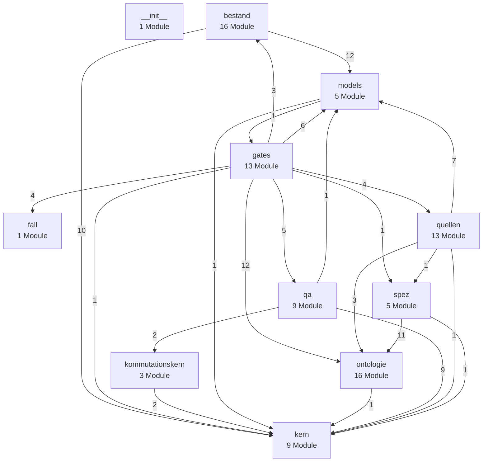
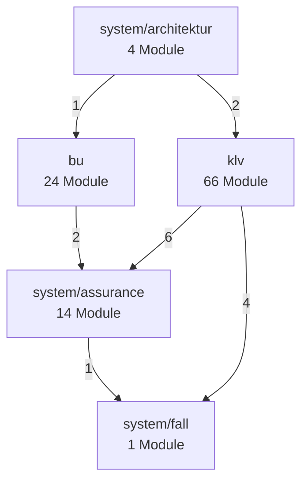
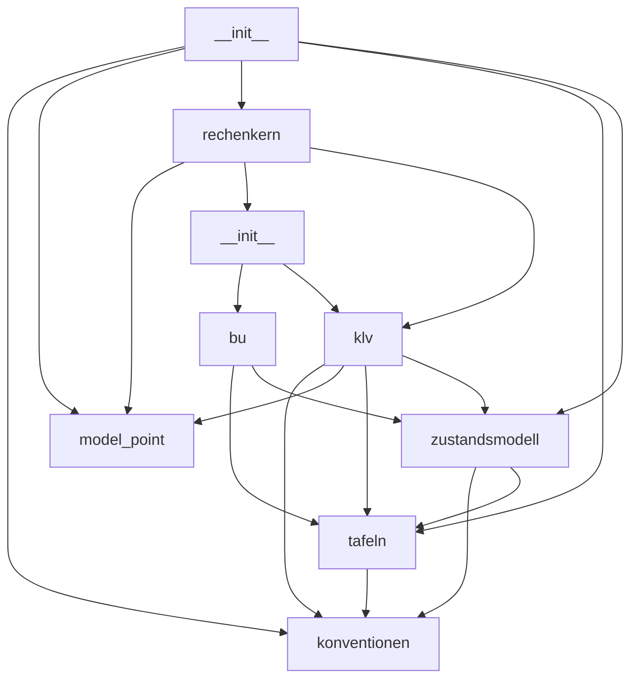

# Landkarte des Zielsystems

Erzeugt aus dem Code, nicht gepflegt. Neu bauen:

```bash
python -m rechner_pipeline.ontologie.landkarte --format mermaid --umfang schichten --out /dev/stdout
python -m rechner_pipeline.ontologie.landkarte --format mermaid --umfang knoten    --out /dev/stdout
python -m rechner_pipeline.ontologie.landkarte --format mermaid --umfang modul --auswahl kern --out /dev/stdout
```

Ein Test haelt diese Seite gegen den Generator: weicht sie ab, faellt die
Suite. GitHub zeichnet die Diagramme direkt; fuer Graphviz, Gephi, yEd
oder einen Graph-Store liefert derselbe Befehl `--format dot` bzw.
`--format graphml`.

Im Zielbild (~1 Mio. Zeilen) gibt es kein Bild "der Codebasis". Es gibt
begrenzte Ausschnitte, und alle drei hier wachsen mit der Struktur statt
mit der Codemenge: der Schichten-Ueberblick, die fachliche Knotensicht,
und der Blick in EINEN Knoten. Ueberschreitet ein Ausschnitt 60 Kaesten,
verweigert der Generator das Bild und nennt den engeren Weg.

## 1 Schichten — der Ueberblick

Wer darf aus wem importieren, und wie oft wird es genutzt. Die Regeln
dahinter sind nachrechenbar (`ontologie.code_karte`), nicht Prosa.



## 2 Fachknoten — die Sicht der Ontologie

Dieselben IDs wie in der A-Box eines Migrationsfalls und in Gate P-K1. Eine
Kante entsteht nur bei einem ECHTEN Uebergang: ein Rueckgrat-Modul, das
`klv, bu` traegt, macht KLV nicht von BU abhaengig — beide stehen darauf.
Deshalb sind KLV und BU hier korrekt unverbunden.



## 3 Der Zielrechenkern von innen

Die neun Module von `kern/` und ihre Abhaengigkeiten. `tafeln` ist die
unterste Fachschicht (reine Ausscheidewahrscheinlichkeiten),
`zustandsmodell` das Rueckgrat, die Produkte sind Parametrierungen
darauf (ADR-004).


