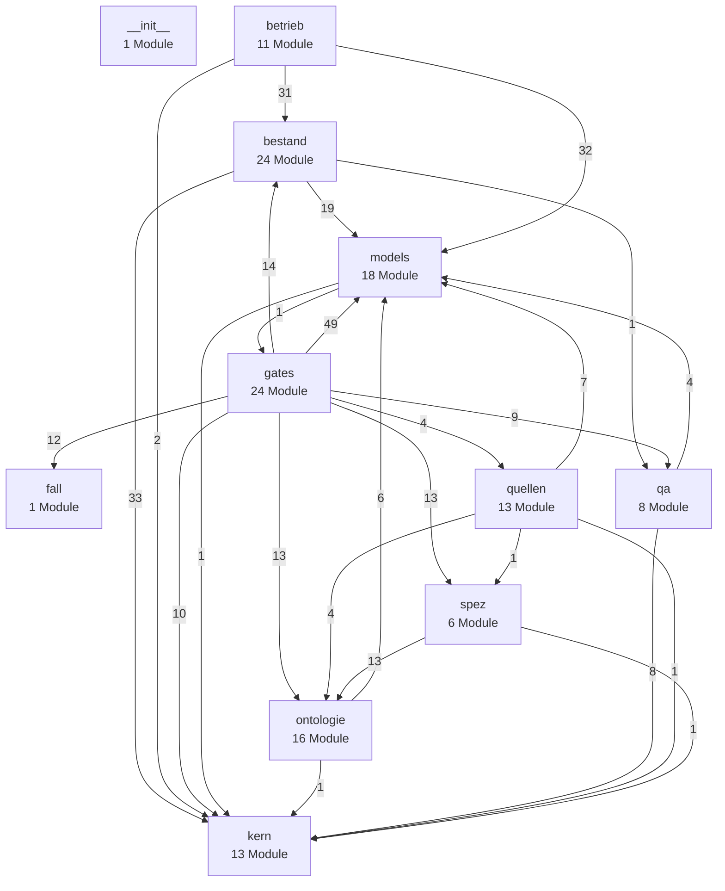
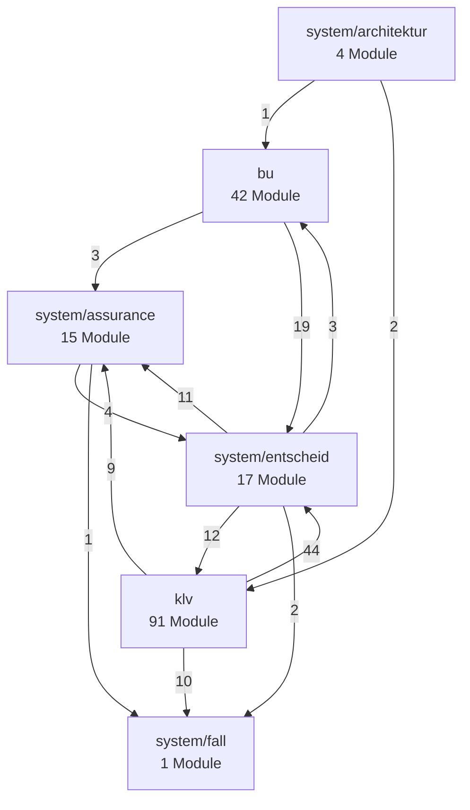
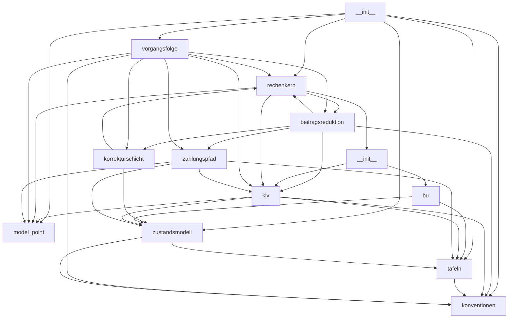

# Landkarte des Zielsystems

Die Diagramme sind aus dem Code erzeugt, nicht gepflegt. Neu bauen:

```bash
python -m rechner_pipeline.ontologie.landkarte --format mermaid --umfang schichten --out runs/landkarte-schichten.mmd
python -m rechner_pipeline.ontologie.landkarte --format mermaid --umfang knoten --out runs/landkarte-knoten.mmd
python -m rechner_pipeline.ontologie.landkarte --format mermaid --umfang modul --auswahl kern --out runs/landkarte-kern.mmd
```

Die drei Dateien ersetzen die drei Diagramme unten, in dieser Reihenfolge.
Nach `/dev/stdout` zu schreiben taugt nicht: Das Kommando gibt dort auch
seinen JSON-Ergebnisrahmen aus.

Ein Test hält diese Seite gegen den Generator: weicht sie ab, fällt die
Suite. GitHub zeichnet die Diagramme direkt; für Graphviz, Gephi, yEd
oder einen Graph-Store liefert derselbe Befehl `--format dot` bzw.
`--format graphml`.

Im Zielbild (~1 Mio. Zeilen) gibt es kein Bild „der Codebasis“. Es gibt
begrenzte Ausschnitte, und alle drei hier wachsen mit der Struktur statt
mit der Codemenge: der Schichten-Überblick, die fachliche Knotensicht,
und der Blick in einen einzelnen Knoten. Überschreitet ein Ausschnitt 60 Kästen,
verweigert der Generator das Bild und nennt den engeren Weg.

## 1 Schichten — der Überblick

Wer darf aus wem importieren, und wie oft wird es genutzt. Die Regeln
dahinter sind nachrechenbar (`ontologie.code_karte`), nicht Prosa.


```mermaid
%% Schichten — erzeugt von ontologie.landkarte
flowchart TD
    n__init__["__init__<br/>1 Module"]
    bestand["bestand<br/>24 Module"]
    betrieb["betrieb<br/>11 Module"]
    fall["fall<br/>1 Module"]
    gates["gates<br/>24 Module"]
    kern["kern<br/>13 Module"]
    models["models<br/>18 Module"]
    ontologie["ontologie<br/>16 Module"]
    qa["qa<br/>8 Module"]
    quellen["quellen<br/>13 Module"]
    spez["spez<br/>6 Module"]
    bestand -- 33 --> kern
    bestand -- 19 --> models
    bestand -- 1 --> qa
    betrieb -- 31 --> bestand
    betrieb -- 2 --> kern
    betrieb -- 32 --> models
    gates -- 14 --> bestand
    gates -- 12 --> fall
    gates -- 10 --> kern
    gates -- 49 --> models
    gates -- 13 --> ontologie
    gates -- 9 --> qa
    gates -- 4 --> quellen
    gates -- 13 --> spez
    models -- 1 --> gates
    models -- 1 --> kern
    ontologie -- 1 --> kern
    ontologie -- 6 --> models
    qa -- 8 --> kern
    qa -- 4 --> models
    quellen -- 1 --> kern
    quellen -- 7 --> models
    quellen -- 4 --> ontologie
    quellen -- 1 --> spez
    spez -- 1 --> kern
    spez -- 13 --> ontologie
```

## 2 Fachknoten — die Sicht der Ontologie

Dieselben IDs wie in der A-Box eines Migrationsfalls und in Gate O3. Eine
Kante entsteht nur bei einem echten Übergang: ein Rückgrat-Modul, das
`klv, bu` trägt, macht KLV nicht von BU abhängig — beide stehen darauf.
Deshalb sind KLV und BU hier korrekt unverbunden.


```mermaid
%% Fachknoten — erzeugt von ontologie.landkarte
flowchart TD
    bu["bu<br/>42 Module"]
    klv["klv<br/>91 Module"]
    system_architektur["system/architektur<br/>4 Module"]
    system_assurance["system/assurance<br/>15 Module"]
    system_entscheid["system/entscheid<br/>17 Module"]
    system_fall["system/fall<br/>1 Module"]
    bu -- 3 --> system_assurance
    bu -- 19 --> system_entscheid
    klv -- 9 --> system_assurance
    klv -- 44 --> system_entscheid
    klv -- 10 --> system_fall
    system_architektur -- 1 --> bu
    system_architektur -- 2 --> klv
    system_assurance -- 4 --> system_entscheid
    system_assurance -- 1 --> system_fall
    system_entscheid -- 3 --> bu
    system_entscheid -- 12 --> klv
    system_entscheid -- 11 --> system_assurance
    system_entscheid -- 2 --> system_fall
```

## 3 Der Zielrechenkern von innen

Die neun Module von `kern/` und ihre Abhängigkeiten. `tafeln` ist die
unterste Fachschicht (reine Ausscheidewahrscheinlichkeiten),
`zustandsmodell` das Rückgrat, die Produkte sind Parametrierungen
darauf (ADR-004).


```mermaid
%% kern — erzeugt von ontologie.landkarte
flowchart TD
    rechner_pipeline_kern___init___py["__init__"]
    rechner_pipeline_kern_beitragsreduktion_py["beitragsreduktion"]
    rechner_pipeline_kern_konventionen_py["konventionen"]
    rechner_pipeline_kern_korrekturschicht_py["korrekturschicht"]
    rechner_pipeline_kern_model_point_py["model_point"]
    rechner_pipeline_kern_produkte___init___py["__init__"]
    rechner_pipeline_kern_produkte_bu_py["bu"]
    rechner_pipeline_kern_produkte_klv_py["klv"]
    rechner_pipeline_kern_rechenkern_py["rechenkern"]
    rechner_pipeline_kern_tafeln_py["tafeln"]
    rechner_pipeline_kern_vorgangsfolge_py["vorgangsfolge"]
    rechner_pipeline_kern_zahlungspfad_py["zahlungspfad"]
    rechner_pipeline_kern_zustandsmodell_py["zustandsmodell"]
    rechner_pipeline_kern___init___py --> rechner_pipeline_kern_konventionen_py
    rechner_pipeline_kern___init___py --> rechner_pipeline_kern_model_point_py
    rechner_pipeline_kern___init___py --> rechner_pipeline_kern_rechenkern_py
    rechner_pipeline_kern___init___py --> rechner_pipeline_kern_tafeln_py
    rechner_pipeline_kern___init___py --> rechner_pipeline_kern_vorgangsfolge_py
    rechner_pipeline_kern___init___py --> rechner_pipeline_kern_zustandsmodell_py
    rechner_pipeline_kern_beitragsreduktion_py --> rechner_pipeline_kern_konventionen_py
    rechner_pipeline_kern_beitragsreduktion_py --> rechner_pipeline_kern_korrekturschicht_py
    rechner_pipeline_kern_beitragsreduktion_py --> rechner_pipeline_kern_produkte_klv_py
    rechner_pipeline_kern_beitragsreduktion_py --> rechner_pipeline_kern_rechenkern_py
    rechner_pipeline_kern_beitragsreduktion_py --> rechner_pipeline_kern_zahlungspfad_py
    rechner_pipeline_kern_korrekturschicht_py --> rechner_pipeline_kern_rechenkern_py
    rechner_pipeline_kern_korrekturschicht_py --> rechner_pipeline_kern_zustandsmodell_py
    rechner_pipeline_kern_produkte___init___py --> rechner_pipeline_kern_produkte_bu_py
    rechner_pipeline_kern_produkte___init___py --> rechner_pipeline_kern_produkte_klv_py
    rechner_pipeline_kern_produkte_bu_py --> rechner_pipeline_kern_tafeln_py
    rechner_pipeline_kern_produkte_bu_py --> rechner_pipeline_kern_zustandsmodell_py
    rechner_pipeline_kern_produkte_klv_py --> rechner_pipeline_kern_konventionen_py
    rechner_pipeline_kern_produkte_klv_py --> rechner_pipeline_kern_model_point_py
    rechner_pipeline_kern_produkte_klv_py --> rechner_pipeline_kern_tafeln_py
    rechner_pipeline_kern_produkte_klv_py --> rechner_pipeline_kern_zustandsmodell_py
    rechner_pipeline_kern_rechenkern_py --> rechner_pipeline_kern_beitragsreduktion_py
    rechner_pipeline_kern_rechenkern_py --> rechner_pipeline_kern_model_point_py
    rechner_pipeline_kern_rechenkern_py --> rechner_pipeline_kern_produkte___init___py
    rechner_pipeline_kern_rechenkern_py --> rechner_pipeline_kern_produkte_klv_py
    rechner_pipeline_kern_tafeln_py --> rechner_pipeline_kern_konventionen_py
    rechner_pipeline_kern_vorgangsfolge_py --> rechner_pipeline_kern_beitragsreduktion_py
    rechner_pipeline_kern_vorgangsfolge_py --> rechner_pipeline_kern_konventionen_py
    rechner_pipeline_kern_vorgangsfolge_py --> rechner_pipeline_kern_korrekturschicht_py
    rechner_pipeline_kern_vorgangsfolge_py --> rechner_pipeline_kern_model_point_py
    rechner_pipeline_kern_vorgangsfolge_py --> rechner_pipeline_kern_produkte_klv_py
    rechner_pipeline_kern_vorgangsfolge_py --> rechner_pipeline_kern_rechenkern_py
    rechner_pipeline_kern_vorgangsfolge_py --> rechner_pipeline_kern_zahlungspfad_py
    rechner_pipeline_kern_zahlungspfad_py --> rechner_pipeline_kern_model_point_py
    rechner_pipeline_kern_zahlungspfad_py --> rechner_pipeline_kern_produkte_klv_py
    rechner_pipeline_kern_zahlungspfad_py --> rechner_pipeline_kern_tafeln_py
    rechner_pipeline_kern_zahlungspfad_py --> rechner_pipeline_kern_zustandsmodell_py
    rechner_pipeline_kern_zustandsmodell_py --> rechner_pipeline_kern_konventionen_py
    rechner_pipeline_kern_zustandsmodell_py --> rechner_pipeline_kern_tafeln_py
```
